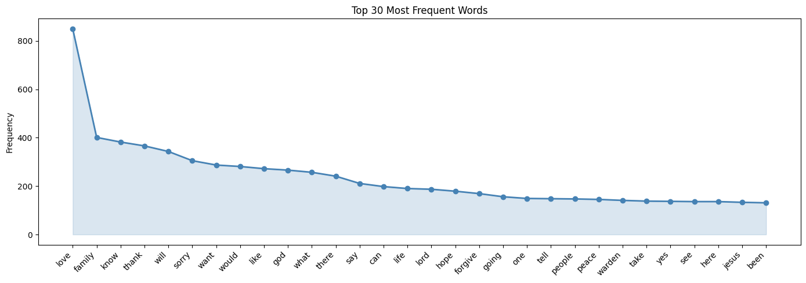
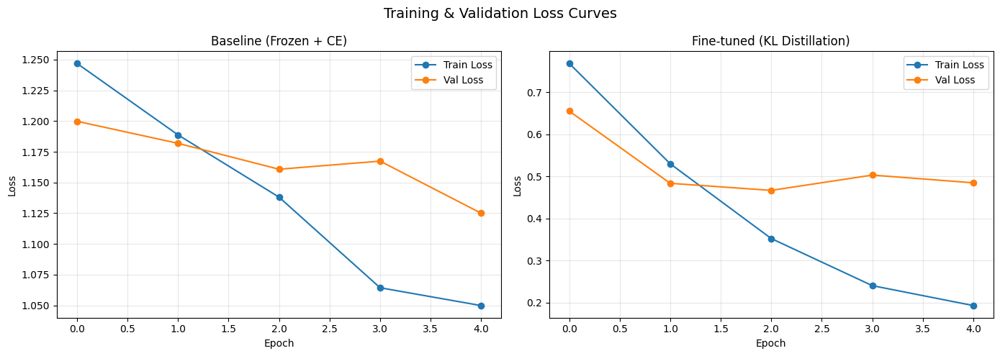
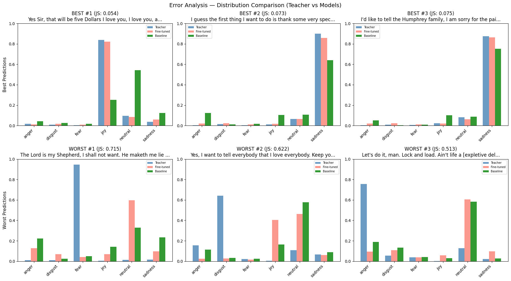
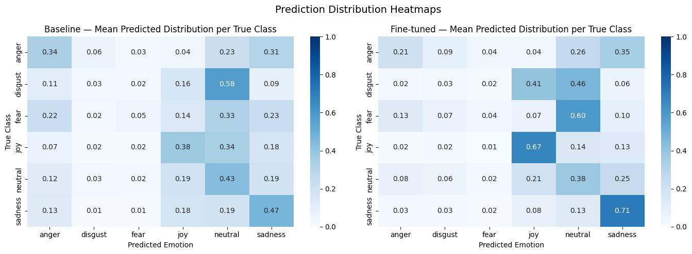
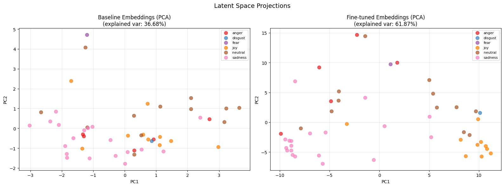
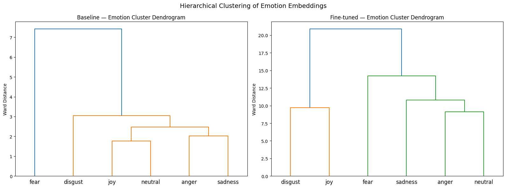
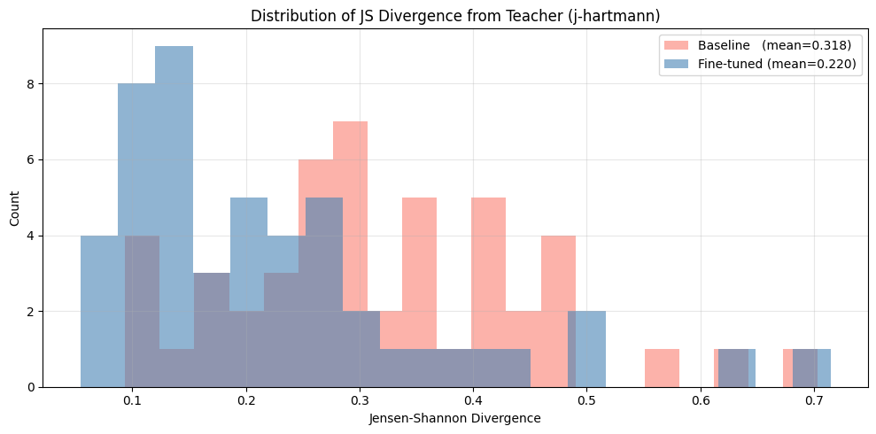

# Emotion Analysis of Death Row Last Statements
### Domain-Specific Knowledge Distillation with DistilBERT

---

## Overview

This project performs domain-specific knowledge distillation for emotion recognition on a unique and sensitive dataset - the final statements of death row inmates in Texas. Since no ground truth emotion labels exist, a pretrained teacher model (j-hartmann/emotion-english-distilroberta-base) is used to generate soft probability distributions over 7 emotions for each statement. The surprise class was discarded during labeling as it was empirically absent from the dataset - last statements are deliberate, composed texts that do not contain the spontaneous reactions surprise typically describes - leaving 6 emotion classes: anger, disgust, fear, joy, neutral, and sadness. A smaller student model (DistilBERT) is then fine-tuned to replicate these distributions using KL divergence loss, which is the natural choice when targets are full probability distributions rather than single classes. A frozen DistilBERT baseline is trained with standard cross-entropy loss on hard labels (argmax of the teacher distribution) as comparison - cross-entropy is appropriate here because collapsing the soft distribution to a single integer class label reduces the target to a standard one-hot classification problem, for which cross-entropy is the conventional loss.

---

## Model Background

**DistilBERT** is a distilled version of BERT (Bidirectional Encoder Representations from Transformers), retaining 97% of BERT's language understanding at 40% less size and 60% faster inference. Like BERT, it uses a transformer encoder with self-attention to build rich contextual representations of text. The `[CLS]` token embedding serves as a sentence-level representation and is passed to a classification head for emotion prediction.

**j-hartmann/emotion-english-distilroberta-base** is a RoBERTa-based model fine-tuned on a mixture of emotion datasets covering 7 classes: anger, disgust, fear, joy, neutral, sadness, and surprise. It serves as the teacher model in this project, generating soft probability distributions that encode nuanced emotional signal rather than hard single-class labels.

**Knowledge Distillation** is the technique of training a student model to match a teacher model's output distributions rather than ground truth labels. By minimizing KL divergence between teacher and student distributions, the student learns to replicate the teacher's emotional judgment while adapting to the specific linguistic domain it is trained on.

---

## Dataset

**Source:** Texas Department of Criminal Justice (TDCJ) - [https://www.tdcj.texas.gov/death_row/dr_executed_offenders.html]

The dataset was collected by scraping the TDCJ website and contains the last statements of executed inmates in Texas. All 492 non-empty/not "None" scraped statements were retained including short entries, "no statement" declarations, and statements containing non-English phrases - discarding them would have reduced an already small dataset further. Eleven statements were removed pre-labeling due to exceeding 512 tokens in length, as clipping the longer statements at exactly 512 tokens would not help with capturing the emotional essenence of inmates last words. Two statements were removed post-labeling because they received a surprise score exceeding 0.10 from the teacher model, which was inconsistent with the decision to drop surprise as a class. The final dataset contains 479 statements.

| Property | Value |
|---|---|
| Number of executed inmates in Texas | 597 (as of 27.02.2026) |
| Total non-empty/not "None" entries scraped  |  492 |
| Removed (>512 tokens long) | 11 |
| Removed (surprise > 0.10) | 2 |
| Avg. word count | ~100 words |
| Language | English (with some Spanish and Arabic religious phrases) |
| Labels | None (pseudo-labeled via j-hartmann) |

Statements range from brief farewells ("I love you all. See you on the other side.") to lengthy reflections on guilt, forgiveness, and faith. The emotional register is highly specific - formal, restrained, and often simultaneously expressing sadness, love, and peace.

---

## Implementation & Design Choices

### Preprocessing
- Whitespace normalization and curly quote standardization

### Labeling
Teacher model (j-hartmann) ran on all valid statements to produce soft 7-dimensional probability distributions. Hard labels derived as argmax of the soft distribution for the baseline model.

### Models

| | Baseline | Fine-tuned |
|---|---|---|
| Architecture | DistilBERT (frozen) + MLP head | DistilBERT (trainable) + MLP head |
| Trainable params | ~198K | ~67M |
| Loss function | Cross Entropy | KL Divergence |
| Label type | Hard (argmax) | Soft (full distribution) |
| Learning rate | 1e-3 | 2e-5 |

### Training
- 80 / 10 / 10 train/val/test split (383 / 48 / 48 samples)
- Batch size: 8
- Epochs: 5
- Optimizer: AdamW (no scheduler)

---

## Evaluation Metrics & Results

### Distribution Matching (vs. Teacher)

| Metric | Baseline | Fine-tuned |
|---|---|---|
| Mean JS Divergence ↓ | 0.3180 | **0.2200** |
| Mean Pearson r ↑ | 0.6257 | **0.7676** |
| Top-1 Agreement ↑ | 0.5833 | **0.6667** |
| Top-2 Agreement ↑ | 0.4583 | **0.5625** |

### Clustering Quality (Embedding Space)

| Metric | Baseline | Fine-tuned |
|---|---|---|
| Silhouette Score ↑ | -0.1078 | **0.0284** |
| Davies-Bouldin Score ↓ | 2.6255 | **1.7470** |
| Calinski-Harabasz Score ↑ | 1.9467 | **5.5689** |

The fine-tuned model outperforms the baseline on all seven metrics without exception.

---

## Visualizations

### Word Frequency & Themes

The most frequent words across all statements are strongly relational and emotional - love, family, thank, sorry, forgive, and peace dominate the corpus. Religious vocabulary appears consistently (god, lord, jesus), reflecting how commonly spirituality features in final statements. Reflective language (know, life, hope) suggests a contemplative register across the dataset, while procedural words tied to the execution setting (warden, take) appear as artifacts of the context rather than emotional content. The overall lexical profile points to four dominant themes: love, apology, faith, and closure - which aligns with the emotion distribution found after labeling, where sadness and neutral are the most prevalent classes.

### Training Curves

The baseline shows stable convergence with train and val loss tracking closely - expected for a frozen model with few trainable parameters. The fine-tuned model shows clear overfitting after epoch 2, with train loss continuing to fall while val loss plateaus around 0.45 - consistent with fine-tuning 67M parameters on ~336 samples.

### Error Analysis

Test set predictions were ranked by JS divergence to identify best and worst cases. The best predictions (JS < 0.08) are emotionally unambiguous statements - expressions of love, explicit apology, or clear farewell - where the fine-tuned model closely matches the teacher while the baseline defaults to neutral. The worst predictions (JS > 0.60) share a common failure mode: both models collapse to neutral on statements the teacher labeled with strong non-neutral emotions, most notably a full recitation of the 23rd Psalm (labeled fear) and a brief defiant statement (labeled anger) - cases where the surface language is calm or colloquial despite the teacher inferring strong underlying emotion. Of 48 test samples, 16 (33%) produced different dominant emotion predictions between the two models, with the fine-tuned model matching the teacher more closely in the majority of disagreements - most commonly by correctly resolving sadness and joy where the baseline predicted neutral.

### Prediction Heatmaps

The fine-tuned model achieves significantly stronger diagonal values - joy (0.67), sadness (0.71), fear (0.60) - compared to the baseline's weak diagonals, reflecting substantially reduced neutral bias. Anger remains the hardest class for both models.

### PCA Latent Space

Explained variance nearly doubles from 36.68% (baseline) to 61.87% (fine-tuned), indicating the fine-tuned model's embeddings are substantially more structured around emotional content. The fine-tuned PCA shows visible separation between joy, sadness, and neutral clusters that is absent in the baseline.

### Dendrogram

The baseline produces a linguistically incoherent hierarchy (joy merges with neutral; anger merges with sadness) while the fine-tuned model produces an emotionally coherent structure where negative emotions (fear, sadness, anger) cluster together and are separated from positive/neutral ones.

### JS Divergence Histogram

The fine-tuned distribution is strongly left-skewed with most predictions in the 0.05–0.20 range, while the baseline distributes broadly across 0.10–0.70. The improvement is broad and consistent rather than driven by easy outliers.

---

## Discussion

### Insights
- Domain adaptation measurably improves emotion recognition even with a small dataset and only 5 epochs of training
- The frozen baseline develops a strong neutral/sadness bias - it defaults to neutral or sadness for emotionally complex statements that the fine-tuned model resolves correctly
- 33% of test predictions (16/48) differed between models, with the fine-tuned model matching the teacher more closely in almost all disagreement cases
- The emotional language of last statements - forgiveness, love, prayer, resignation - is sufficiently distinct from general English that domain-specific training produces meaningful gains

### Limitations
- No human-annotated ground truth exists; all evaluation is relative to j-hartmann's judgment, which carries its own noise and domain mismatch biases
- The fine-tuned model overfits after epoch 2 due to the small training set size relative to model capacity
- Class imbalance (sadness and neutral dominant; disgust extremely rare) affects per-class reliability
- Anger is consistently misclassified - likely because overt anger is rare and linguistically subtle in this domain
- Some teacher labels are questionable (e.g., psalm recitation labeled as fear; farewell statement labeled as disgust)

### Improvements
- Human annotation of a subset by psychology or domain experts would enable absolute rather than relative evaluation
- Early stopping at epoch 2 for the fine-tuned model would reduce overfitting
- Augmenting the dataset with similar domains (prison letters, terminal illness testimonies) would address the dataset size constraint
- Temperature scaling during distillation could produce better-calibrated soft targets
- A separate handling strategy for religious and liturgical text - a distinct sub-domain within the dataset - could address a systematic failure mode identified in error analysis

---

## Tools & Libraries

- `python 3.9+` 
- `torch`
- `requests`
- `transformers`
- `scikit-learn``scipy`
- `pandas` 
- `numpy` 
- `matplotlib`
- `seaborn`
- `beautifulsoup4`
- `tqdm`

---
